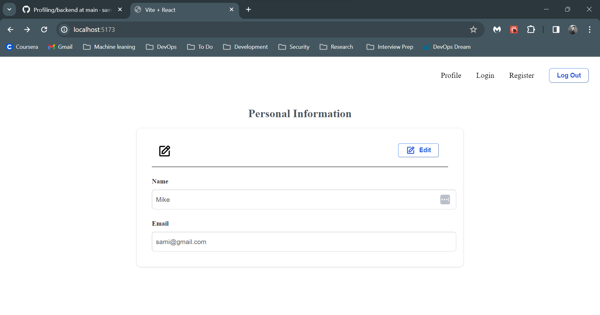

# Project Title

Basic Auth and Profiling using React for the front-end, Express for the backend and MongoDB for database. 

## Table of Contents
- [Installation](#installation)
- [Usage](#usage)
- [Features](#features)
- [Screenshots](#screenshots)
  

## Installation


To get started with this project, follow these steps:

1. Clone the project repository:
    ```bash
    git clone https://github.com/sammigul/Profiling.git
    ```

2. Navigate to the frontend directory:
    ```bash
    cd frontend
    ```

3. Install frontend dependencies:
    ```bash
    npm install
    ```

4. Navigate to the backend directory:
    ```bash
    cd ../backend
    ```

5. Install backend dependencies:
    ```bash
    npm install
    ```

6. Ensure you have the necessary access tokens and secrets:
    - Check `ACCESSTOKEN` and `REFRESHTOKEN` secret in `/backend/src/config/.env`.


## Usage

To run the project, follow these steps:

1. Navigate into the frontend directory:
    ```bash
    cd frontend
    ```

2. Run the following command to start the frontend server:
    ```bash
    npm run dev
    ```

   This will run the app on server 5173.

3. Similarly, navigate to the backend directory:
    ```bash
    cd ../backend
    ```

4. Run the following command to start the backend server:
    ```bash
    npm start
    ```

   This will run the server on port 3000.

## Features

User Authentication & Authorization, Routing, Responsive design. 

## Screenshots



